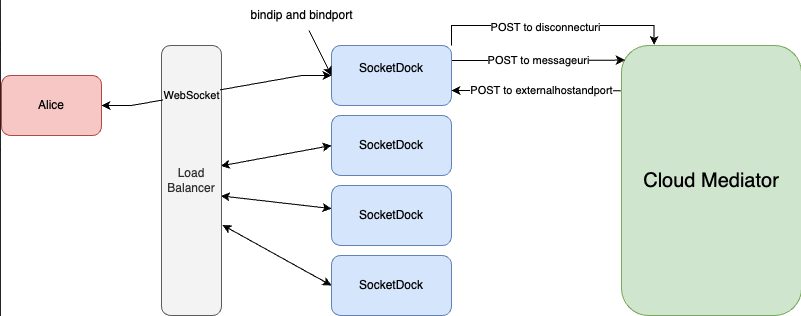

# SocketDock

A WebSocket Relay Service

SocketDock serves as a relay between WebSocket-oriented agents and backends that don't support WebSockets natively. Arbitrarily many instances of SocketDock can be spun up behind a load balancer, which serves WebSocket connections to a specific instance of SocketDock. SocketDock will receive messages addressed to the backend and transport them across HTTP to the backend. No state is shared between instances of SocketDock, allowing for easy scaling. 

Messages are forwarded unmodified, with some additional metadata to allow the backend to associate the sender of the message with the SocketDock instance it's connected to (see [messageuri](#messageuri) below). When a WebSocket is terminated, SocketDock will send a message to the `disconnecturi`, informing the backend that the connection has been terminated.



## Configuration
### `bindip` and `bindport`
These reference what the instance of SocketDock is running on. This is where inbound WebSockets connect.

### `messageuri`
This is the HTTP endpoint of whatever backend that SocketDock is in front of. SocketDock will pass messages, along with some metadata, to this endpoint.

**Note:** this is sent as a string, not a JSON object

```
{
    "meta": {
                "connection_id": <socket_id>,
                "send": "http://<externalhostandport>/socket/<socket_id>/send",
            }, 
    "message": message
}
```
### `disconnecturi`
When a WebSocket is terminated, SocketDock will inform the backend of the disconnect. This allows the backend to proactively adjust its behavior—queueing messages instead of attempting live delivery, in case of a mediator, for example.

If a SocketDock instance fails, the backend won't know of the terminated connection and will attempt to behave normally. In that case, an error will be thrown when attempting to POST to the endpoint, and the backend should adjust its behavior at that time. 

### `externalhostandport`
This is the endpoint on which SocketDock is expecting responses from the backend. This information is used to construct the callback URI (see [messageuri](#messageuri) above). 

### `backend`
This variable currently has 2 options: `loopback` and `http`. This determines which backend SocketDock is expecting. `loopback` turns SocketDock into an echo server, where any message sent to it SocketDock is immediately sent directly back. This option is primarily used for local testing and demoing. `http` is used when an HTTP-enabled backend implementation is being used, as in many production scenarios.

Additional backends may be added in the future, as need arises. 